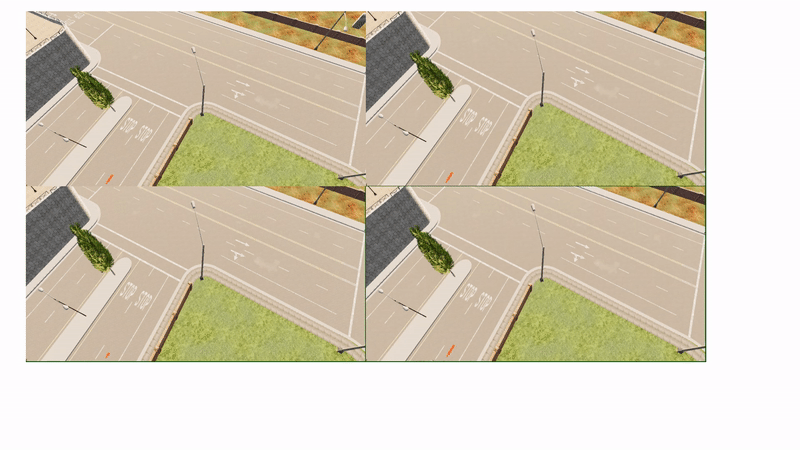

# Autonomous-turning-of-vehicle-and-overtaking-in-CARLA

This project aims to automate left and right turns and overtaking for autonomous vehicles with the self-driving cars simulator [CARLA](http://carla.org/). The two main focus are on  ***Turning*** and ***Overtaking*** by Bezier curve ([Bezier Curve](https://en.wikipedia.org/wiki/B%C3%A9zier_curve)).

## Test Platform
Windows 10
[CARLA](http://carla.org/) 0.9.11

#### Carla Simulator Installation
Go to official [Carla Releases](https://github.com/carla-simulator/carla/releases) Github page.

Download **[Windows] CARLA 0.9.11**, unzip the file and rename the folder as **CARLA_0.9.11**. Additional maps are optional.

Put **CARLA_Simulator** folder and **this repository** folder in the same folder. So the folder structure should look like:

#### Other prerequisites

`numpy`,  `opencv` and `pygame` should be correctly installed.

## Run Instruction

#### Performing Phase

1. Go to **CARLA_0.9.11** folder,

   `cd Carla/CARLA_0.9.11` 

   run CARLA in Low Graphic Quality

   `./CarlaUE4.sh -quality-level=Low`

   
2. Go to the **environment folder** of **this repository**. 
    There are options for generating different scenes. 
    

   To perform turning in empty city:

   `python ego_vehicle.py`
   
   To perform turning in city with n=80 vehicles:
   run `ego_vehicle.py` first
   `python ego_vehicle
   
   Open new terminal. go to exaples directory of PythonAPI of carla repository
   
   `cd C:\CARLA_0.9.11\WindowsNoEditor\PythonAPI\examples`
   
   Spawn n=80 vehicle of how many you want
   
   `python spawn_npc.py -n 80`
   

   
   To perform overtaking when there is one vehicle in front, generate scene 1 where only the ego vehicle exists by:

   `python ego_vehicle.py -s 1`
   
***Note: Overtaking is still experimental and might fail in heavy traffic environment. Do not spawn vehicles for overtaking***
 
## Results

    
     

    
     

